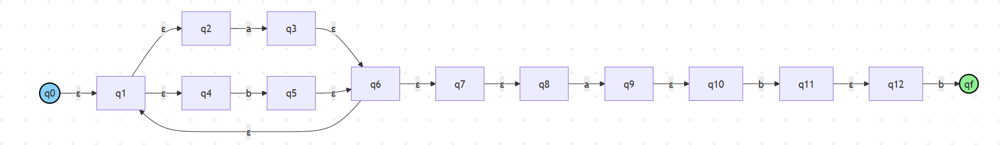
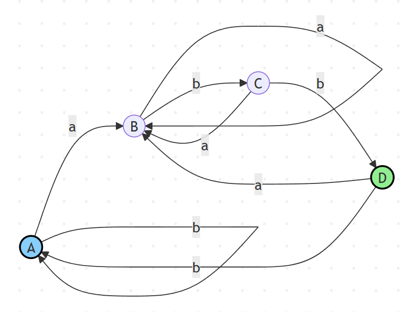
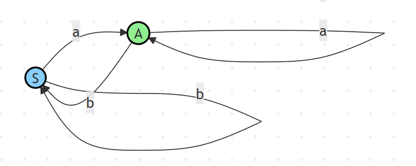

# Conversión entre Modelos Formales  
## ER → AFD y AFD → Gramática  

---

## Integrantes

- Jean Paul Ortiz  
- Iván Daniel Naranjo  
- María Andrea Avendaño  
- Alexandra Puerta  

---

##  Introducción

En este documento se presentan dos procesos fundamentales dentro de la teoría de autómatas:

- Conversión de **Expresión Regular (ER) a Autómata Finito Determinista (AFD)**  
- Conversión de **Autómata Finito Determinista (AFD) a Gramática Regular**

Estos procesos permiten demostrar la equivalencia entre diferentes representaciones de los lenguajes regulares.

---

#  Parte 1: Conversión de ER → AFD

##  Expresión Regular

(a|b)*abb

---

##  Paso 1: ER → AFND (Método de Thompson)

---

## Paso 2: AFND → AFD (Construcción de subconjuntos)

### Tabla de transición

| Estado | a | b |
|--------|---|---|
| A      | B | A |
| B      | B | C |
| C      | B | D |
| D      | B | A |

--- 

## AFD Final

--- 

## Conclusiones
- Se requiere un paso intermedio (AFND)
- Se eliminan transiciones ε
- Se obtiene un autómata determinista equivalente

---

#  Parte 2: Conversión de AFD → Gramática

## Descripción

Este proceso permite convertir un Autómata Finito Determinista (AFD) en una **Gramática Regular (Tipo 3)**.

---

## Idea clave

- Cada estado del AFD → un **no terminal**
- Cada transición → una **producción**
- Cada estado final → producción con **ε**

---

## AFD dado

---

## Tabla de transición

| Estado | a | b |
|--------|---|---|
| S      | A | S |
| A      | A | S |

---

## Paso 1: Asignar variables

Cada estado del AFD se convierte en una variable (no terminal):

- S → estado inicial  
- A → estado  

---

## Paso 2: Crear producciones

Se crean producciones a partir de las transiciones del AFD:

- δ(S, a) = A → S → aA  
- δ(S, b) = S → S → bS  
- δ(A, a) = A → A → aA  
- δ(A, b) = S → A → bS  

---

## Paso 3: Estado final

Como el estado **A** es de aceptación, se agrega:

A → ε

---

## Gramática final

S → aA | bS

A → aA | bS | ε

---

## Conclusiones

- El proceso es directo y sistemático  
- Cada estado se convierte en una variable  
- Cada transición se convierte en producción  
- Los estados finales generan ε  
- Se mantiene el mismo lenguaje del AFD  

---

## Errores comunes

- Olvidar agregar ε en estados finales  
- No incluir todas las transiciones  
- Confundir estados con símbolos  
- Escribir mal las producciones  Mira como quedo, esta bien y entendible?