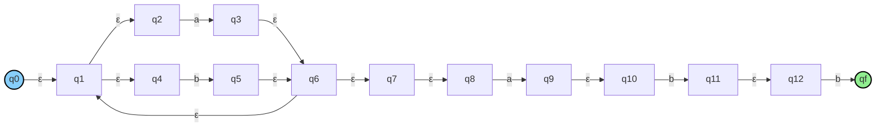

# Conversión entre Modelos Formales  
## ER → AFD y AFD → Gramática  

---

## Integrantes

- Jean Paul Ortiz  
- Iván Daniel Naranjo  
- María Andrea Avendaño  
- Alexandra Puerta  

---

##  Introducción

En este documento se presentan dos procesos fundamentales dentro de la teoría de autómatas:

- Conversión de **Expresión Regular (ER) a Autómata Finito Determinista (AFD)**  
- Conversión de **Autómata Finito Determinista (AFD) a Gramática Regular**

Estos procesos permiten demostrar la equivalencia entre diferentes representaciones de los lenguajes regulares.

---

#  Parte 1: Conversión de ER → AFD

##  Expresión Regular

(a|b)*abb

---

##  Paso 1: ER → AFND (Método de Thompson)

---

## Paso 2: AFND → AFD (Construcción de subconjuntos)

### Tabla de transición

| Estado | a | b |
|--------|---|---|
| A      | B | A |
| B      | B | C |
| C      | B | D |
| D      | B | A |

## AFD Final

graph LR
    A((A)):::inicio -->|a| B
    A -->|b| A

    B((B)) -->|a| B
    B -->|b| C

    C((C)) -->|a| B
    C -->|b| D

    D((D)):::final -->|a| B
    D -->|b| A

    classDef inicio fill:#87CEFA,stroke:#000,stroke-width:2px;
    classDef final fill:#90EE90,stroke:#000,stroke-width:2px;

## Conclusiones
- Se requiere un paso intermedio (AFND)
- Se eliminan transiciones ε
- Se obtiene un autómata determinista equivalente